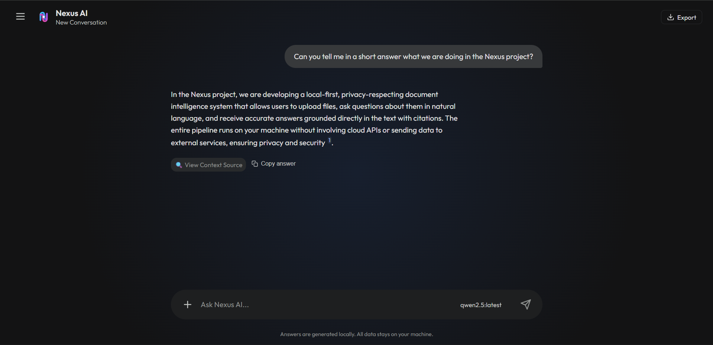

# AI Document Assistant — Retrieval-Augmented Generation (RAG)



A local-first, privacy-respecting document intelligence system that lets you upload files, ask questions about them in natural language, and get accurate answers grounded in the actual text — with citations. The entire pipeline runs on your machine. No cloud APIs, no telemetry, no data leaving your network. Ever.

The system exists because the obvious alternative — pasting sensitive documents into ChatGPT or Claude and hoping the provider keeps its privacy promises — is not acceptable when the documents contain CVs, contracts, medical records, internal reports, or anything you would not email to a stranger. I built something that gives you the same conversational document understanding, but where "private" is a verifiable architectural property, not a policy checkbox.

This repository is what I built.

---

## Overview

You start the system with a single `docker compose up`. Three containers come up: an Ollama instance that pulls and serves two local models (a chat model and an embedding model), a FastAPI backend that handles ingestion, retrieval, and generation, and an Nginx frontend that serves a custom-built chat interface. The entire stack fits on a laptop with 8 GB of RAM.

Upload a PDF, a Word document, a text file, Markdown, or HTML. The backend parses it, splits it into overlapping text chunks, embeds each chunk into a high-dimensional vector using `nomic-embed-text`, and stores the vectors in a FAISS index alongside a BM25 keyword index. When you ask a question, the system runs both a semantic vector search and a keyword search in parallel, merges the results using Reciprocal Rank Fusion, re-ranks the top candidates with a Cross-Encoder neural model ([`ms-marco-MiniLM-L-6-v2`](https://huggingface.co/cross-encoder/ms-marco-MiniLM-L-6-v2)), and injects the winning chunks into a prompt sent to the local LLM. The answer streams back token by token, with citation markers that link each claim to the specific source chunk it came from.

Inside, there are twelve modules under [app/](app/), a custom frontend in [ui/](ui/) (HTML/CSS/JS — no framework), two Dockerfiles, an Nginx reverse proxy, and a `docker-compose.yml` that wires the whole thing into a self-managing stack. The rest of this document is a tour of why each piece is shaped the way it is.

---

## The Problem It Solves

I started this project because I needed to ask questions about my own documents — CVs, project specs, internal reports — and every tool that could do it wanted me to upload those documents to someone else's server.

The commercial options are well-known. ChatGPT's file upload feature sends your document to OpenAI's servers. Claude does the same with Anthropic. Google's NotebookLM processes your files on Google's infrastructure. Every one of them has a privacy policy that says some version of "we may use your data to improve our services," and every one of them requires you to trust that policy. For a personal CV, maybe that is fine. For a client contract, a medical record, or a company's internal engineering spec, it is not.

The open-source alternatives were not much better. Most RAG tutorials I found were toy demos — a Jupyter notebook that calls the OpenAI API with a retrieval step bolted on. They solved the "how to do RAG" question but not the "how to do RAG without leaking data" question. The ones that did run locally were research prototypes: no UI, no persistence, no conversation history, no way for a non-technical user to interact with them.

The system in this repository is the answer to that gap. It runs entirely on your machine — the LLM, the embedding model, the vector store, the database, the frontend, all of it. The Docker network is internal. The Nginx proxy listens on `localhost`. There is no outbound network call at any point in the pipeline. If you disconnect your internet and ask a question, the answer comes back exactly the same.

That is the core design constraint, and every other decision flows from it.

---

## How It Works

At the highest level, the system is a five-stage pipeline with a feedback loop through conversation history:

```
   document upload (PDF / DOCX / TXT / MD / HTML)
          |
          v
   ingestion pipeline
   (parse → chunk → embed → store in FAISS + BM25)
          |
          v
   hybrid retrieval
   (semantic search + keyword search → RRF fusion → Cross-Encoder re-ranking)
          |
          v
   answer generation
   (top chunks injected into prompt → streamed to user with [^X] citations)
          |
          v
   conversation persistence
   (full history saved to SQLite → resumable across sessions)
```

Each stage exists because a specific failure mode demanded it. The pipeline is sequential and largely deterministic until the generation step, which is the only place a black-box model gets a voice — and even there, the prompt is structured to force grounded, cited answers.

**Stage 1 — Ingestion.** The user uploads a file through the chat interface. The backend saves it to disk, validates the file type (checking magic bytes, not just the extension), checks for duplicates via SHA-256 hash, and hands it to the ingestion pipeline. [ingestion.py](app/ingestion.py) dispatches to the right parser: PyMuPDF for PDFs, python-docx for Word files, BeautifulSoup for HTML, raw read for plain text and Markdown. The parsed text is split into 1000-character chunks with 200-character overlap using LangChain's `RecursiveCharacterTextSplitter`. The overlap exists so that a sentence straddling a chunk boundary is not lost — a failure mode I observed early on where answers about content near chunk edges were consistently wrong.

**Stage 2 — Embedding and indexing.** Each chunk is embedded into a 768-dimensional vector by `nomic-embed-text`, served locally by Ollama. The vectors go into a FAISS `IndexFlatL2` for exact nearest-neighbour search. Simultaneously, the raw chunk text is tokenized and indexed by BM25. Both indices persist to disk, so restarting the system does not require re-embedding. A document registry backed by SQLite ([document_registry.py](app/document_registry.py)) tracks every uploaded file, its hash, its chunk count, and its upload timestamp — so re-uploading the same file is caught and rejected before any compute is wasted.

**Stage 3 — Hybrid retrieval with re-ranking.** When the user asks a question, the question text is embedded with the same model and also tokenized for BM25. FAISS returns the top `3K` candidates by cosine similarity; BM25 returns the top `3K` candidates by keyword relevance. The two result sets are merged using Reciprocal Rank Fusion, which naturally balances the strengths of both: semantic search catches paraphrased or conceptually similar content, while BM25 catches exact names, dates, and technical terms that embeddings tend to blur. The fused candidates are then re-ranked by a Cross-Encoder model (`ms-marco-MiniLM-L-6-v2` from `sentence-transformers`), which scores each question-chunk pair with a dedicated relevance classifier rather than relying on embedding distance. This second pass dramatically improves precision — in my testing, it consistently promoted the actually-relevant chunk above superficially-similar distractors. The top `K` survivors (default 8) are sent to the next stage.

**Stage 4 — Answer generation with citations.** The winning chunks are formatted with explicit `[Source X: filename]` headers and injected into a structured prompt sent to the local LLM. The system prompt instructs the model to ground every claim in the provided context and cite sources using `[^X]` markers. The response streams back token by token via Server-Sent Events. A post-processing filter in the streaming pipeline strips any `[Source X: filename]` labels the model might copy verbatim from the context (LLMs do this despite being told not to — the filter is deterministic and catches it every time). On the frontend, the `[^X]` markers are rendered as superscript numbers with hover tooltips showing the source filename and an excerpt of the cited text.

**Stage 5 — Conversation persistence.** Every question and answer is saved to a SQLite database ([conversation.py](app/conversation.py)) with the full context chunks, the model used, and a timestamp. Conversations are auto-titled from the first question, can be renamed, deleted, or exported as PDF or Markdown. The sidebar shows the full conversation history, and clicking any past conversation loads it instantly. This is not a demo feature — it is the difference between a tool you use once and a tool you keep open.

---

## The Pipeline in Detail

<details>
<summary><strong>Hybrid Search — why not just embeddings?</strong></summary>

The first version of this system used only FAISS vector search. It worked well for conceptual questions ("What are Mohammad's technical skills?") but failed catastrophically on exact lookups ("What is the company's phone number?", "When was the document signed?"). Embedding models compress text into a semantic space where "phone number" and "contact information" are close together, but the actual digits `+972-XXX-XXXX` are nowhere near anything. BM25 finds them instantly because it matches tokens, not meaning.

The fix was to run both in parallel and merge with Reciprocal Rank Fusion. RRF assigns each result a score of `1 / (k + rank)` where `k` is a constant (60 by default), then sums across the two result lists. A chunk that ranks #1 in both gets the highest fused score; a chunk that ranks #1 in one but is absent from the other still appears, just lower. The constant `k` controls how much weight the top ranks carry relative to the tail — at 60, the difference between rank 1 and rank 2 is small, which makes the fusion forgiving of minor ranking disagreements.

This alone was a significant improvement. But the fused list still had a problem: the top 8 chunks by RRF score were not always the 8 most relevant. Two chunks from the same paragraph might both rank highly because they share vocabulary with the question, pushing out a genuinely different chunk that would have added new information. The Cross-Encoder re-ranker solves this by scoring each candidate independently against the question using a model specifically trained for relevance classification, not just similarity.

</details>

<details>
<summary><strong>Cross-Encoder Re-ranking — the accuracy upgrade</strong></summary>

The Cross-Encoder (`cross-encoder/ms-marco-MiniLM-L-6-v2`) is a 22M parameter model trained on the MS MARCO passage ranking dataset. Unlike the embedding model, which compresses text into a fixed vector independently of the query, the Cross-Encoder takes the question and the chunk as a single input pair and outputs a relevance score. This makes it dramatically more accurate for ranking, but too slow to run on every chunk in the database — which is why it only sees the top candidates after RRF fusion.

The implementation in [vector_store.py](app/vector_store.py) pulls `3 * top_k` candidates from RRF, scores each one with the Cross-Encoder, and returns the top `top_k` by Cross-Encoder score. The model loads lazily on first use and stays in memory for subsequent queries. On a CPU-only machine, scoring 24 candidates takes under a second. The quality improvement is not subtle — it is the difference between "the answer is somewhere in these 8 chunks" and "the answer is in chunk 1 and chunk 3, and the other 6 are supporting context."

</details>

<details>
<summary><strong>The frontend — why not Streamlit?</strong></summary>

The original frontend was a Streamlit app. It worked, but it had problems that compounded over time. Streamlit re-runs the entire script on every interaction, which made conversation persistence fragile — state management required `st.session_state` hacks that broke when the user refreshed the page. The chat interface felt like a demo, not a tool. Styling was limited to what Streamlit's theming allowed, which is not much.

The current frontend is a custom-built single-page application in vanilla HTML, CSS, and JavaScript. No React, no Vue, no build step. The HTML is in [index.html](ui/index.html), the styles in [style.css](ui/style.css), the logic in [script.js](ui/script.js). Nginx serves the static files and reverse-proxies API requests to the backend, so the browser talks to a single origin on port 8501.

The interface is dark-themed with a responsive sidebar that shows conversation history and uploaded documents. Messages stream in token by token via SSE. Markdown rendering is handled by `marked.js` with syntax highlighting from `highlight.js`. The export feature generates a clean PDF with proper formatting, not a screenshot of the DOM. The settings modal exposes conversation management (rename, delete, clear all). It is a tool that looks and feels like one.

</details>

<details>
<summary><strong>Security — what is locked down</strong></summary>

Privacy is an architectural property, but security is a configuration property. The system includes:

- **Optional API key authentication.** Set the `API_KEY` environment variable and every protected endpoint requires an `Authorization: Bearer <key>` header. Disabled by default for frictionless local use.
- **Rate limiting.** The `/ask` endpoint is capped at 30 requests per minute by default (configurable via `RATE_LIMIT`) to prevent runaway usage if the system is exposed on a network.
- **File validation.** Uploaded files are checked against magic byte signatures, not just extensions. A `.pdf` that is actually a shell script is rejected. Filenames are sanitized to strip path traversal attempts and dangerous characters.
- **Container isolation.** All three services run in Docker containers on an internal Docker network. The only port exposed to the host is 8501 (the frontend). The backend and Ollama are not directly reachable from outside the container network.
- **Structured logging.** Every upload, question, deletion, and error is logged with a timestamp for audit trails.

</details>

---

## Running It

The system is fully containerised. You do not need to install Python, Ollama, or any dependencies manually.

### 1. Clone the repository

```bash
git clone <repository-url>
cd "AI Document Assistant using Retrieval-Augmented"
```

### 2. Start the stack

**CPU mode (all machines):**
```bash
docker compose up --build
```

**GPU mode (NVIDIA GPUs with the [Container Toolkit](https://docs.nvidia.com/datacenter/cloud-native/container-toolkit/latest/install-guide.html)):**
```bash
docker compose -f docker-compose.yml -f docker-compose.gpu.yml up --build
```

The first run takes several minutes while Docker downloads the base images and Ollama pulls the models (`qwen2.5`, `qwen3:4b`, `nomic-embed-text`). Subsequent starts are fast.

### 3. Use it

Open **http://localhost:8501** in your browser. Upload a document using the sidebar. Ask a question. The answer streams back with citations. Your data never leaves your machine.

The API documentation is at **http://localhost:8000/docs** if you want to interact with the backend directly.

---

## Configuration

All settings live in [app/config.py](app/config.py) and can be overridden with environment variables. See [.env.example](.env.example) for a template.

| Variable          | Default                    | Description                          |
|-------------------|----------------------------|--------------------------------------|
| OLLAMA_BASE_URL   | http://localhost:11434      | Ollama server address                |
| LLM_MODEL         | qwen2.5:latest             | Model used for answer generation     |
| EMBEDDING_MODEL   | nomic-embed-text           | Model used for text embeddings       |
| CHUNK_SIZE        | 1000                       | Max characters per text chunk        |
| CHUNK_OVERLAP     | 200                        | Overlap between consecutive chunks   |
| TOP_K             | 8                          | Number of chunks retrieved per query |
| API_KEY           | *(empty — auth disabled)*  | Set to enable API key authentication |
| MAX_FILE_SIZE_MB  | 50                         | Maximum upload file size in MB       |
| RATE_LIMIT        | 30/minute                  | Rate limit for the /ask endpoint     |
| LOG_LEVEL         | INFO                       | Logging verbosity                    |

---

## Project Structure

```
.
├── app/
│   ├── __init__.py          Package metadata
│   ├── auth.py              Optional API key authentication
│   ├── config.py            Centralised settings (env-var overridable)
│   ├── conversation.py      SQLite conversation history with message storage
│   ├── document_registry.py SQLite document registry with duplicate detection
│   ├── file_validator.py    File size, type, and filename validation
│   ├── ingestion.py         Document parsing and text chunking
│   ├── vector_store.py      FAISS + BM25 hybrid search + Cross-Encoder re-ranking
│   ├── retrieval.py         Context assembly with source metadata
│   ├── llm.py               Ollama LLM client, prompt engineering, source-label filter
│   ├── models.py            Pydantic request / response schemas
│   └── main.py              FastAPI application and SSE streaming routes
│
├── ui/
│   ├── index.html           Chat interface (single-page app)
│   ├── style.css            Dark-themed responsive styles
│   ├── script.js            Frontend logic (SSE, citations, conversations, export)
│   └── icon.svg             Application icon
│
├── data/                    Runtime data (git-ignored)
│   ├── uploads/             Uploaded files
│   ├── vector_db/           FAISS index files
│   ├── registry.db          Document registry
│   └── conversations.db     Conversation history
│
├── docker-compose.yml       CPU stack (Ollama + backend + frontend)
├── docker-compose.gpu.yml   GPU overlay for NVIDIA machines
├── Dockerfile.backend       Python 3.11-slim with all dependencies
├── Dockerfile.frontend      Nginx serving static files + reverse proxy
├── nginx.conf               Proxy config routing /api to backend
├── requirements.txt         Pinned Python dependencies
└── README.md                This file
```

---

## API Reference

| Method | Endpoint                    | Description                                    |
|--------|-----------------------------|-------------------------------------------------|
| GET    | /                           | Health check                                   |
| POST   | /upload                     | Upload and ingest a document (duplicates rejected) |
| POST   | /ask                        | Ask a question (streams response via SSE)      |
| GET    | /models                     | List available Ollama chat models              |
| GET    | /documents                  | List all uploaded documents                    |
| DELETE | /documents/{doc_id}         | Delete a document and its chunks               |
| GET    | /conversations              | List all conversations                         |
| POST   | /conversations              | Create a new empty conversation                |
| GET    | /conversations/{id}         | Get full conversation with messages            |
| PATCH  | /conversations/{id}         | Rename a conversation                          |
| DELETE | /conversations/{id}         | Delete a conversation                          |
| DELETE | /conversations              | Delete all conversations                       |
| GET    | /status                     | Vector store status                            |
| POST   | /clear                      | Delete all data                                |

---

## Documentation

For a deeper dive into every module, design decision, and the full RAG pipeline internals, see [docs/DOCUMENTATION.md](docs/DOCUMENTATION.md).
